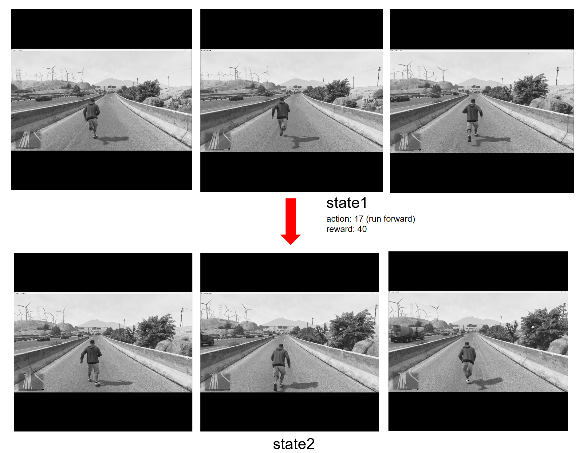

# RL for Game (Dueling DQN + Transformer)

A reinforcement learning framework for automatic game control. The agent learns to play games by observing screen pixels and outputting keyboard/mouse actions, using a **Dueling DQN** architecture with **Transformer** temporal encoding.

---


## Features

- **Dueling DQN** — Value/Advantage dual streams with shared convolutional backbone
- **Transformer temporal encoder** — Self-attention over frame sequences for temporal reasoning
- **Multi-GPU training** — DataParallel across arbitrary GPU IDs
- **Double DQN** — Configurable target estimation to reduce Q-value overestimation
- **Action-balanced sampling** — Inverse-frequency weighted sampling to handle imbalanced action distributions
- **Online learning** — Real-time experience replay with optional Prioritized Experience Replay (PER)
- **Learned reward model** — Neural network for predicting reward from (state, action) during online learning
- **Frame preprocessing** — Offline conversion of .jpg to .npy for I/O-bound-free training
- **Data collection tool** — Screen recording + Tkinter annotation UI with hotkeys
- **Screen capture + inference loop** — Real-time screen capture, model inference, and game input
- **Hotkey AI toggle** — F5 to enable, F6 to disable agent control
- **TensorBoard logging** — Training/online metrics visualization

---



## Project Structure

```
rl_for_game/
├── main.py                          # Entry point (train / inference / online / preprocess)
├── data_collection.py               # Screen recording + annotation tool
├── data_loader.py                   # Dataset, CSV cache, reward statistics
├── online_train.py                  # Online learning loop (inference + replay buffer training)
├── pretrain_reward_model.py         # Pretrain reward model from offline data
├── preprocess_frames.py             # Convert .jpg -> .npy for faster loading
├── resize_frames.py                 # Standalone bulk resize utility
├── test.py                          # Quick deque behavior test (dev only)
├── config/
│   └── config.yaml                  # Unified YAML configuration
├── core/
│   ├── bot_controller.py            # Hotkey listener + AI decision loop
│   ├── frame_buffer.py              # Thread-safe single-frame buffer
│   ├── recorder.py                  # Screen video recording (XVID avi)
│   ├── screen_capture.py            # Background screen capture thread
│   └── vision_engine.py             # Frame preprocessing pipeline
├── input/
│   ├── keyboard_controller.py       # Keyboard input via pynput
│   └── mouse_controller.py          # Mouse input via Win32 SendInput
├── logic/
│   └── decision.py                  # Action ID -> keyboard/mouse execution mapping
├── rl/
│   ├── agent.py                     # DuelingDQN network + RLAgent
│   ├── trainer.py                   # Offline Trainer + OnlineTrainer (with replay buffer)
│   ├── replay_buffer.py             # Uniform replay buffer + Prioritized Replay (SumTree)
│   └── reward_model.py              # Learned reward model (CNN+LSTM+ActionEmbedding)
├── utils/
│   ├── config_loader.py             # YAML loader with deep-merge + validation
│   └── my_logger.py                 # Colored console + daily rotating file logger
├── models/                          # Saved model checkpoints
│   └── dueling_dqn_2000.pth
├── train_data/                      # Training data
│   ├── records.csv                  # Dataset index
│   ├── online_transitions.csv
│   └── saved_videos/                # Per-recording directories of .jpg frames
└── videos/                          # Recorded game footage (from inference mode)
```

---

## Requirements

Python 3.8+ with the following key packages (see [requirements.txt](requirements.txt) for exact versions):

| Package | Purpose |
|---------|---------|
| torch / torchvision | Dueling DQN, Transformer, optimizers |
| opencv-python | Frame I/O, resize, letterbox |
| mss | Screen capture |
| pynput | Keyboard emulation |
| pyyaml | Configuration loading |
| tensorboard | Training metric logging |
| termcolor | Colored console output |
| keyboard | Global hotkey registration (Ctrl+Shift, F5/F6) |
| pydirectinput | Direct game input (fallback/reserved) |

---

## Usage

### 1. Data Collection

```bash
python data_collection.py
```

Records screen at `train_fps` FPS. Controls:
- **Ctrl+Shift** — Mark a moment, continue recording N seconds, then opens annotation dialog
- **Annotation dialog** — Select performed actions and observed rewards, then **Ctrl+S** to save

Output: timestamped frame directories under `train_data/saved_videos/` + entries in `train_data/records.csv`.

### 2. Frame Preprocessing (Optional but Recommended)

Converts all .jpg frames to normalized .npy files, eliminating I/O bottlenecks during training:

```bash
python main.py --mode preprocess
# Force reprocess all frames:
python main.py --mode preprocess --preprocess-force
# Control parallel workers:
python main.py --mode preprocess --preprocess-workers 8
```

### 3. Offline Training

```bash
python main.py --mode train
# Customize:
python main.py --mode train --batch-size 32 --epochs 1000 --gpus 0,1 --auto-batch
```

Checkpoints saved every `save_every` epochs + final model at training end.

### 4. Inference (AI Plays)

```bash
python main.py --mode inference
```

| Hotkey | Action |
|--------|--------|
| **F5** | Enable AI agent |
| **F6** | Disable AI agent, reset internal state |

The agent grabs screen frames in real-time, runs model inference, and executes keyboard/mouse actions.

### 5. Online Learning (Real-Time Training)

```bash
python main.py --mode online
```

Requires a pretrained reward model (`models/reward_model.pth`). The agent plays the game while simultaneously training the DQN via experience replay and updating the reward model via TD-consistency.

### 6. Pretrain Reward Model

```bash
python pretrain_reward_model.py
```

Supervised pretraining on offline CSV data before starting online learning.

---

## Download Dataset
```bash
https://huggingface.co/datasets/zhirui001/RL_for_Game_Dataset
```

## Configuration

All settings live in [config/config.yaml](config/config.yaml). CLI arguments override equivalent config values.

| Section | Key Parameters |
|---------|---------------|
| `app` | `recorder_fps`, `train_fps` |
| `screen` | `monitor_id`, `width`, `height` |
| `ai` | `continue_frames_num` (state frames), `frams_resize` |
| `paths` | `model_path`, `records_csv`, `tensorboard_dir` |
| `train` | `batch_size`, `epochs`, `num_workers`, `balance_actions`, `gpu_ids` |
| `rl` | `gamma`, `lr`, `use_double_dqn`, `model_dim`, `transformer_layers/heads` |
| `inference` | `sleep_ms_when_empty`, `inference_topk`, `tie_delta` |
| `online` | `buffer_capacity`, `use_per`, `reward_model.*` |
| `record` | `enable`, `output_dir` |
| `log` | `level`, `file` |

---

## Model Architecture

### DuelingDQN

```
Input: (frames, H, W) grayscale sequence
  │
  ├─ CNN Encoder: Conv2D(1->32->64->128) + BatchNorm + ResidualBlocks
  ├─ Frame Projection: Linear(128 -> model_dim) + LayerNorm
  ├─ Learned Positional Encoding
  ├─ TransformerEncoder (N layers, multi-head self-attention)
  │
  ├─ Temporal Attention Pooling ----+
  ├─ Last Frame Feature ------------+
  │                                 │
  └─ Fusion -> Value Stream (1) + Advantage Stream (num_actions)
      │
      Q(s,a) = V(s) + A(s,a) - mean(A)
```

**Key techniques:**
- **Dueling DQN**: Separate V and A streams improve action evaluation in states where actions are irrelevant.
- **Double DQN**: Online net selects action, target net evaluates it -- reduces overestimation bias.
- **Attention pooling**: Weighted combination of all temporal features (not just last frame).
- **Tie-breaking**: During inference, if top-2 Q-values differ by less than `inference_tie_delta`, softmax-samples from top-K actions.

---

## Training Pipeline

1. **Record & Annotate** -- Data collection tool captures screen frames and saves action/reward annotations
2. **Preprocess** -- Convert .jpg to .npy (gray + letterbox + normalize)
3. **Offline Training** -- Supervised learning on annotated transitions
   - Load CSV -> build frame sequences -> action-balanced sampling -> Dueling DQN
   - Periodically sync target network
4. **Inference** -- Load trained model, capture screen, execute actions
5. **Online Learning** (optional) -- Continue training during inference via replay buffer + learned reward model

---

## Key Design Decisions

1. **Reward normalization** -- Running mean/std normalization (Welford's algorithm) for stable training across varying reward scales.
2. **Auto batch scaling** -- Automatically scales batch size based on available GPU memory relative to a reference baseline.
3. **Action balancing** -- Inverse-frequency weighted sampling (`balance_alpha` controls intensity) to prevent majority action bias.
4. **Graceful model loading** -- Loads compatible weights even when network architecture changes (partial load with warnings).
5. **Incremental preprocessing** -- Skips existing .npy files by default; `--preprocess-force` for full regeneration.
